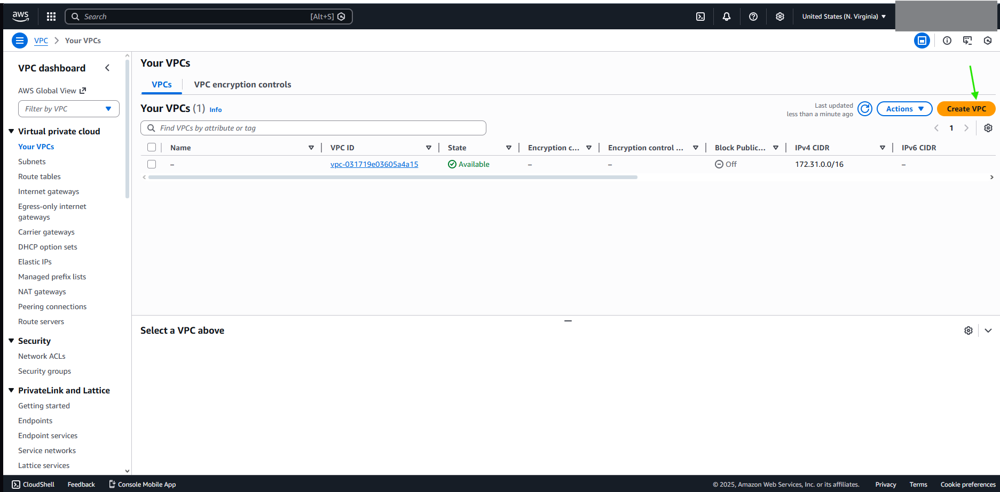
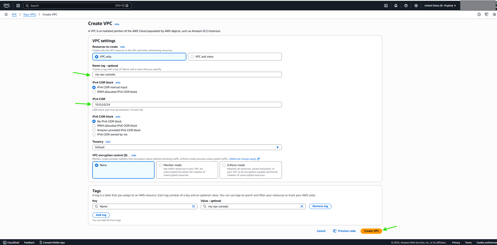
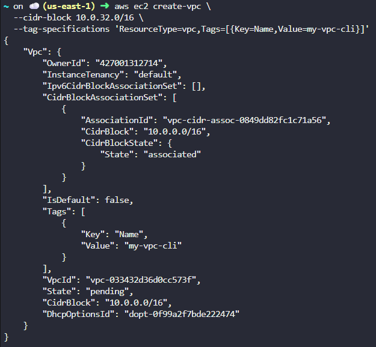
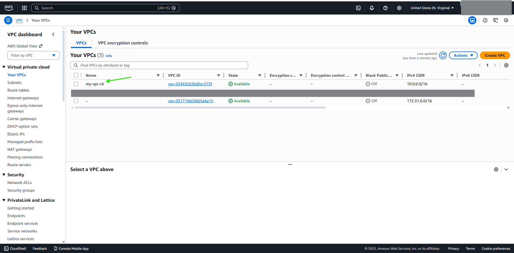

# FROM CONSOLE 

***Choose Name and IPV4 CIDR***

# FROM CLI
***aws ec2 create-vpc \\*** 
  ***--cidr-block 10.0.0.0/16 \\*** 
  ***--tag-specifications 'ResourceType=vpc,Tags=[{Key=Name,Value=my-vpc}]'***

# DONE
