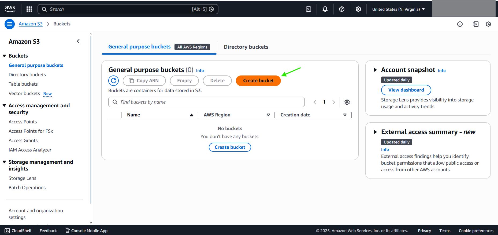
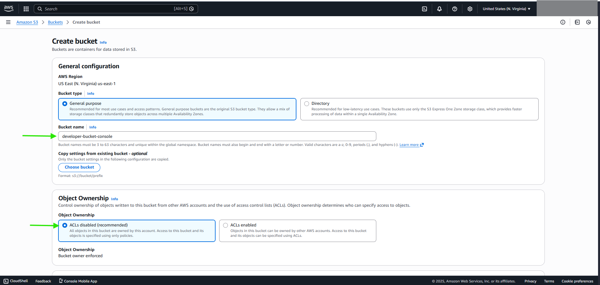
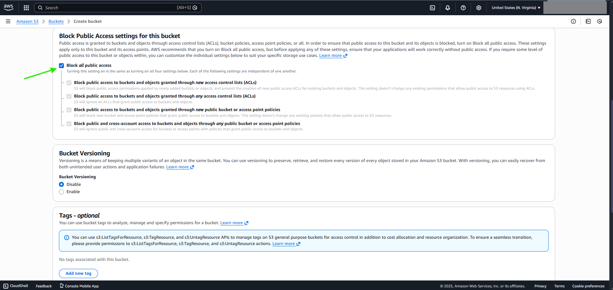
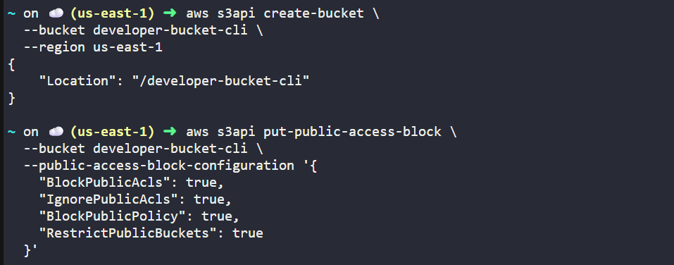
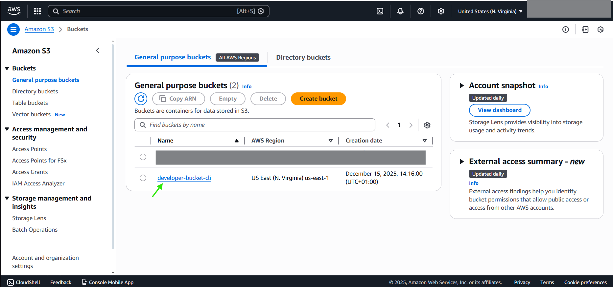

# FROM CONSOLE

***Choose the name of the bucket***

***Block all public access***

# FROM CLI
***aws s3api create-bucket \\*** 
  ***--bucket developer-bucket-cli \\*** 
  ***--region us-east-1***

***aws s3api put-public-access-block \\*** 
  ***--bucket developer-bucket-cli \\*** 
  ***--public-access-block-configuration '{*** 
    ***"BlockPublicAcls": true,*** 
    ***"IgnorePublicAcls": true,*** 
    ***"BlockPublicPolicy": true,*** 
    ***"RestrictPublicBuckets": true*** 
  ***}'***

# DONE

