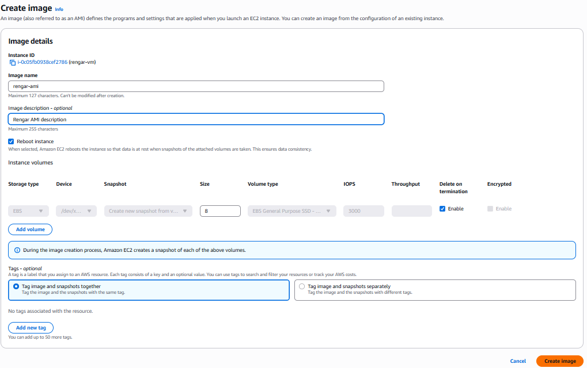
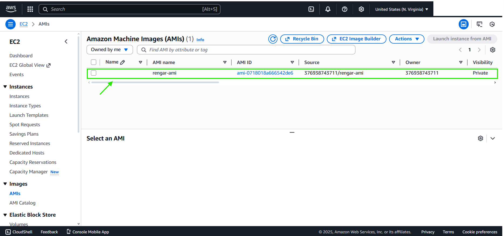
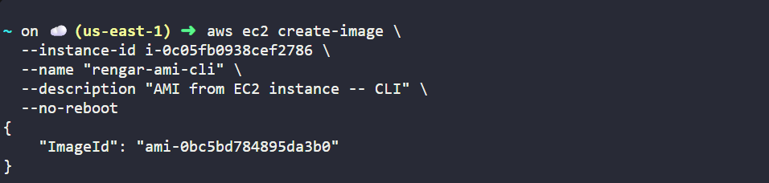

# FROM CONSOLE

***Configure your AMI***

# DONE

# FROM CLI
***aws ec2 create-image \\*** 
  ***--instance-id i-0123456789abcdef0 \\*** 
  ***--name "my-ec2-ami" \\*** 
  ***--description "AMI from EC2 instance" \\*** 
  ***--no-reboot***

# DONE

