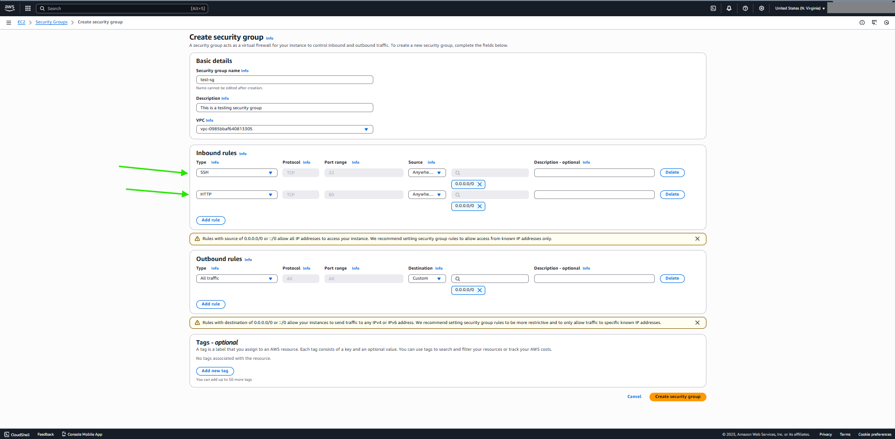
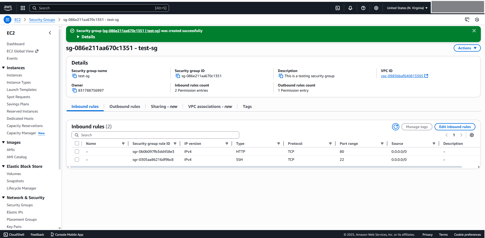

# From AWS Console

# DONE

# FROM CLI
# STEP 1 - Create the security group first, retrieve the desired VPC Id from console or using the CLI
***aws ec2 create-security-group \\ ***
  ***--group-name test-sg \\***
  ***--description "This is a testing security group" \\***
  ***--vpc-id 'YOUR_VPC_ID***
# STEP 2 - Now attach the rule 
***aws ec2 authorize-security-group-ingress \\ ***
  ***--group-id 'YOUR_SG_ID' \\***
  ***--protocol tcp \\***
  ***--port 22 \\***
  ***--cidr 0.0.0.0/0***
# Another rule
***aws ec2 authorize-security-group-ingress \\***
  ***--group-id 'YOUR_SG_ID' \\***
  ***--protocol tcp \\***
  ***--port 80 \\***
  ***--cidr 0.0.0.0/0***