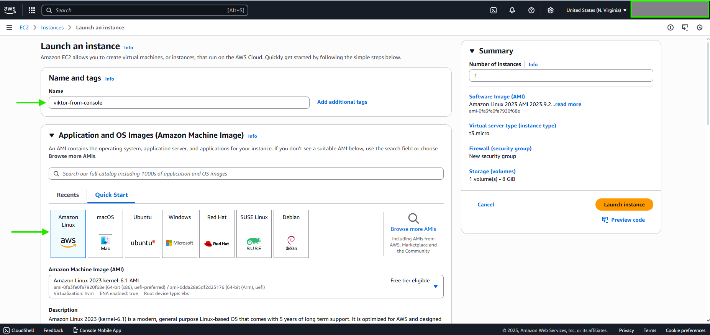
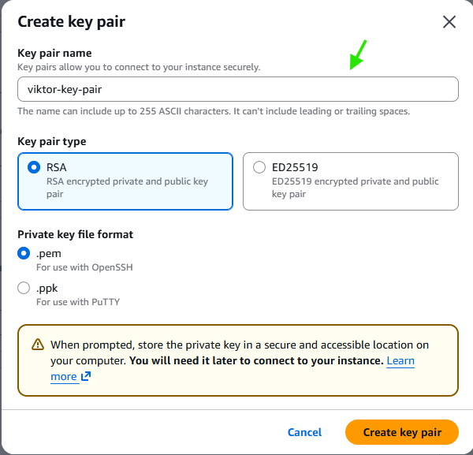
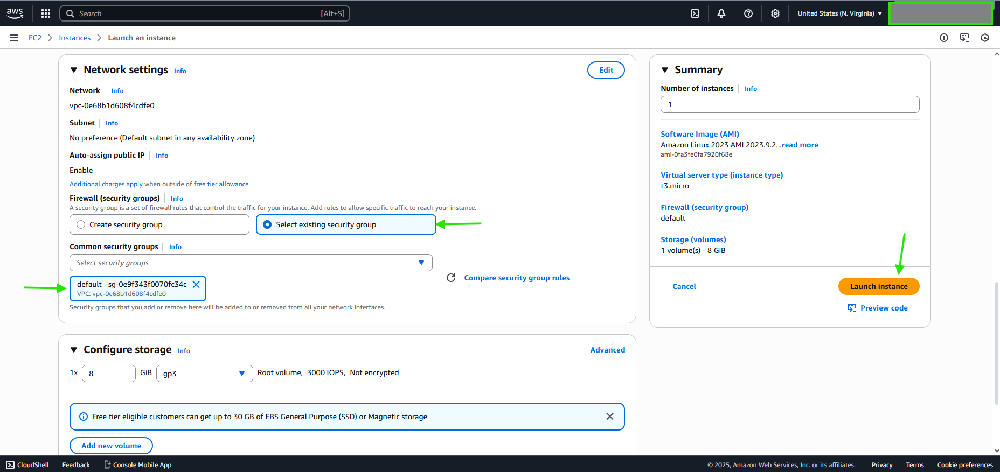
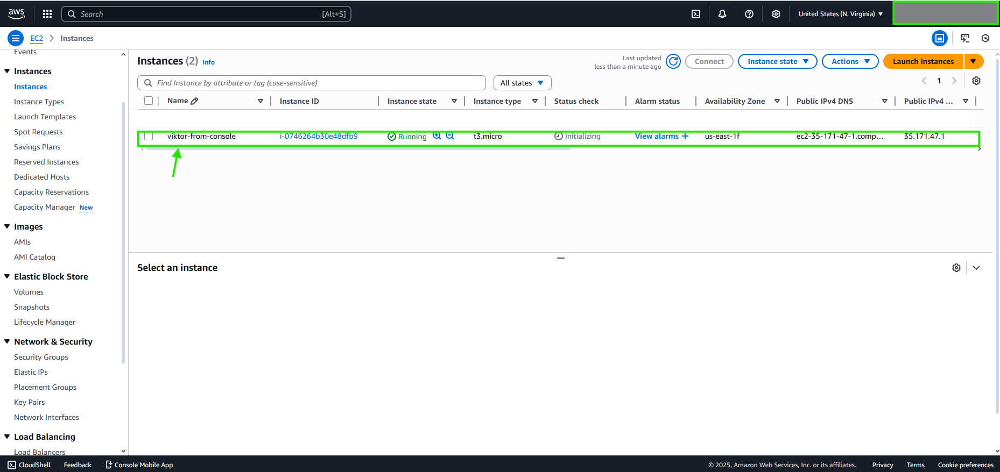
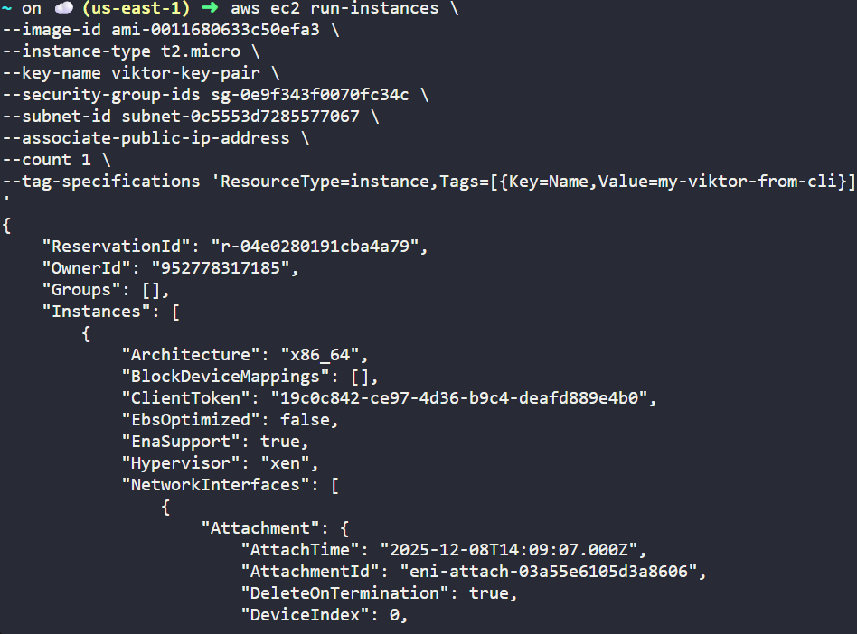
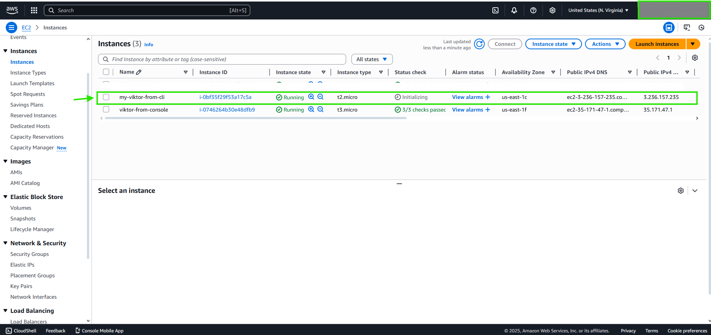

# FROM Console
***From ec2 - launch instance: Choose the name and OS Image***

***Create or select an existing key-pair (your credentials to ssh to the machine)***

 
***Select existing security group or create a new one then select it Finally, click 'Launch' instance'***

# DONE

# FROM CLI
***aws ec2 run-instances \\*** 
  ***--image-id 'YOUR_IMAGE_ID' \\*** 
  ***--instance-type t2.micro \\*** 
  ***--key-name 'YOUR_KEY_NAME' \\*** 
  ***--security-group-ids 'YOUR_SG_ID' \\*** 
  ***--subnet-id 'YOUR_SUBNET_ID' \\*** 
  ***--associate-public-ip-address \\*** 
  ***--count 1 \\*** 
  ***--tag-specifications 'ResourceType=instance,Tags=[{Key=Name,Value=viktor-from-cli}]'***

# DONE

