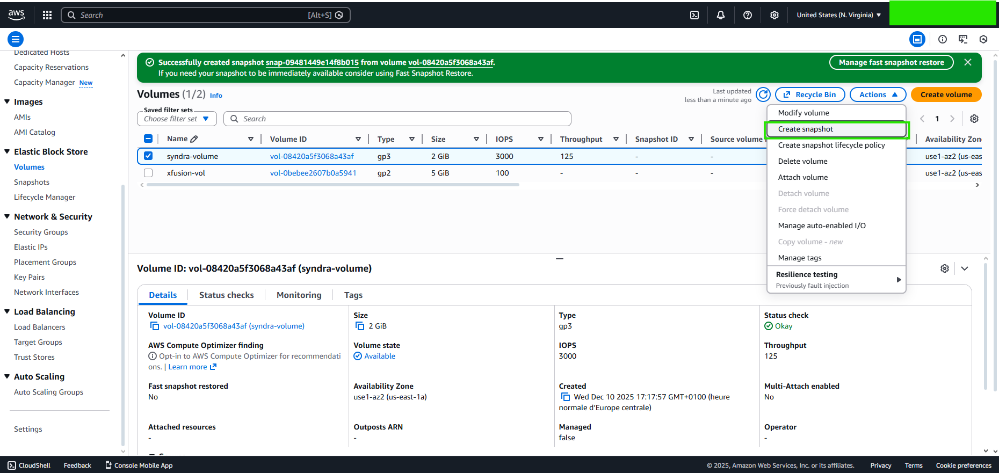
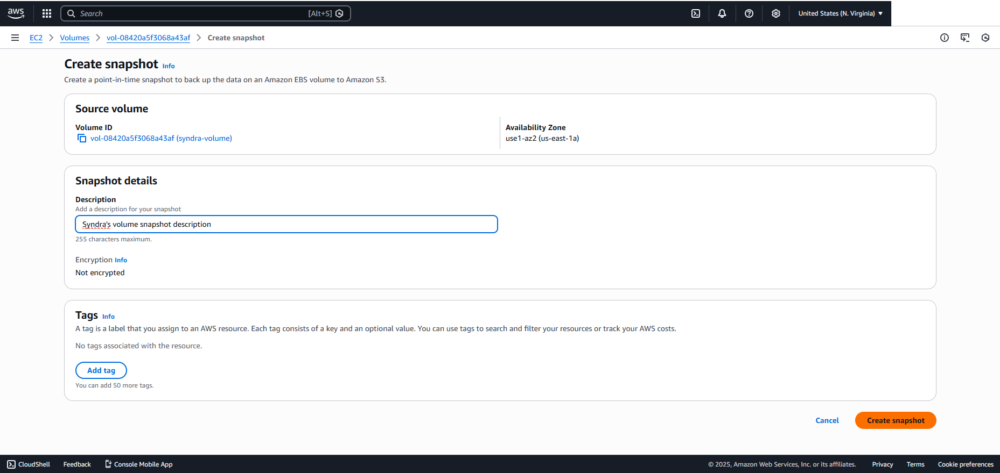
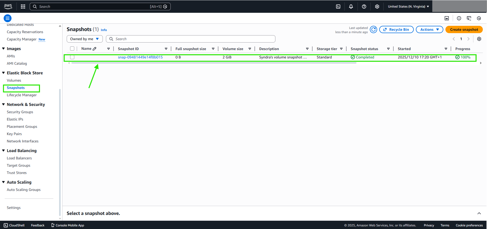
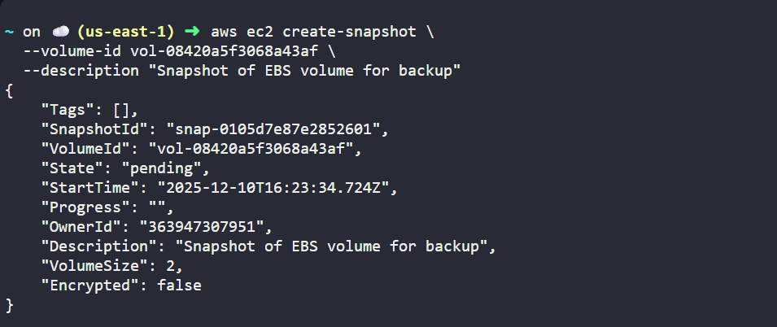
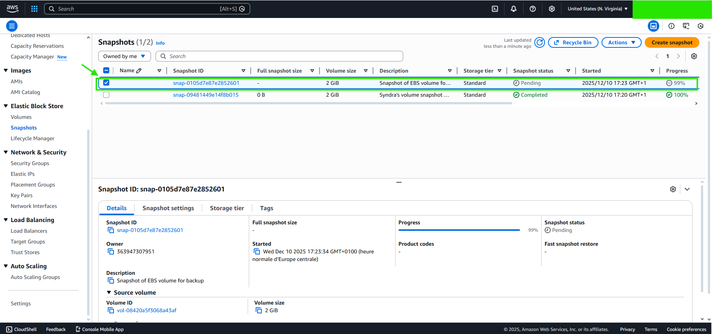

# FROM CONSOLE

***Set description***

# DONE

# FROM CLI
***aws ec2 create-snapshot \\*** 
  ***--volume-id vol-08420a5f3068a43af \*** 
  ***--description "Snapshot of EBS volume for backup"*** 
  

# DONE
