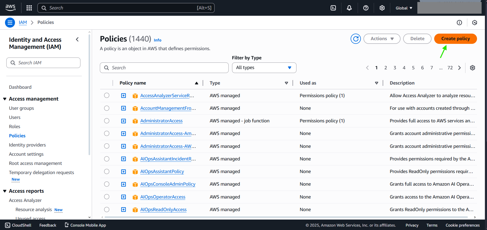
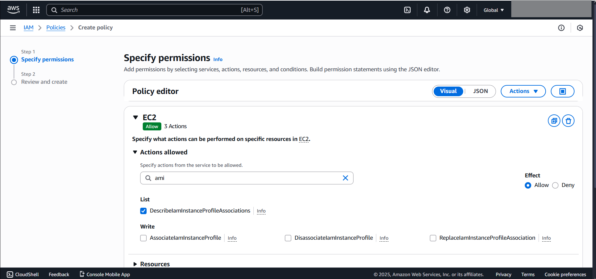
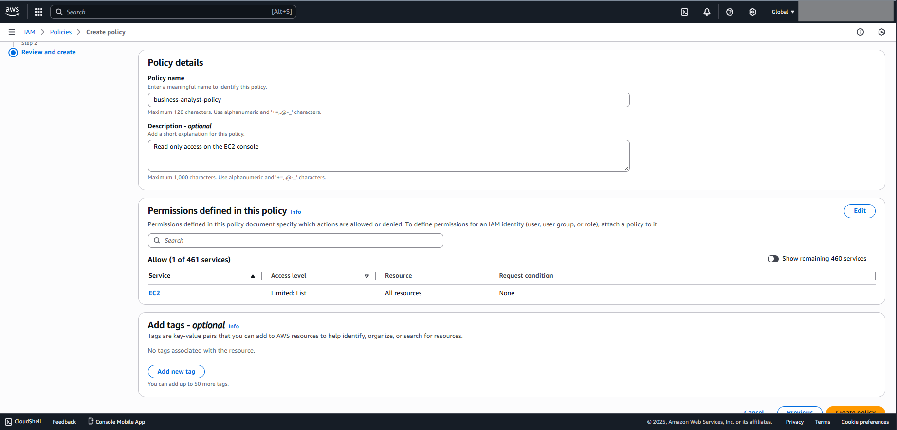

# FROM CONSOLE

***Choose the actions to allow or deny*** 

***Choose the name and description of your policy*** 

# FROM CLI
***aws iam create-policy \\*** 
  ***--policy-name business-analyst-policy \\*** 
  ***--policy-document file://ec2-readonly-policy.json \\*** 
  ***--region us-east-1***

***CONTENT of ec2-readonly-policy.json *** 
***{*** 
  ***"Version": "2012-10-17",*** 
  ***"Statement": [*** 
    ***{*** 
      ***"Effect": "Allow",*** 
      ***"Action": [*** 
        ***"ec2:Describe*"*** 
      ***],*** 
      ***"Resource": "*"*** 
    ***}*** 
  ***]*** 
***}*** 
