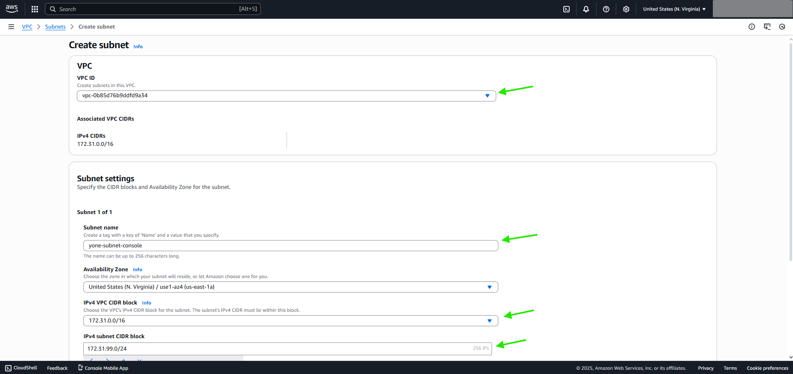
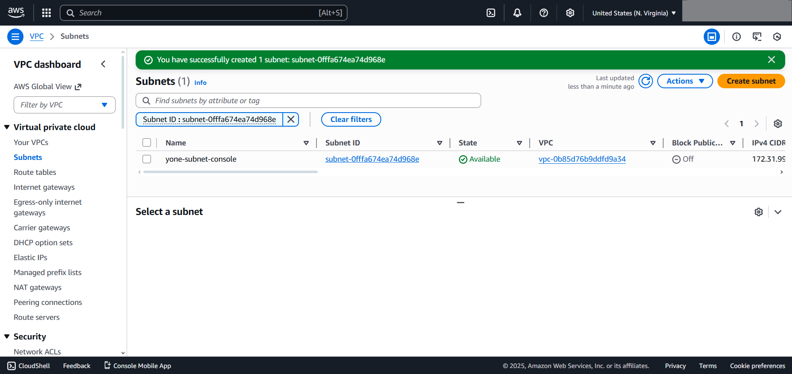
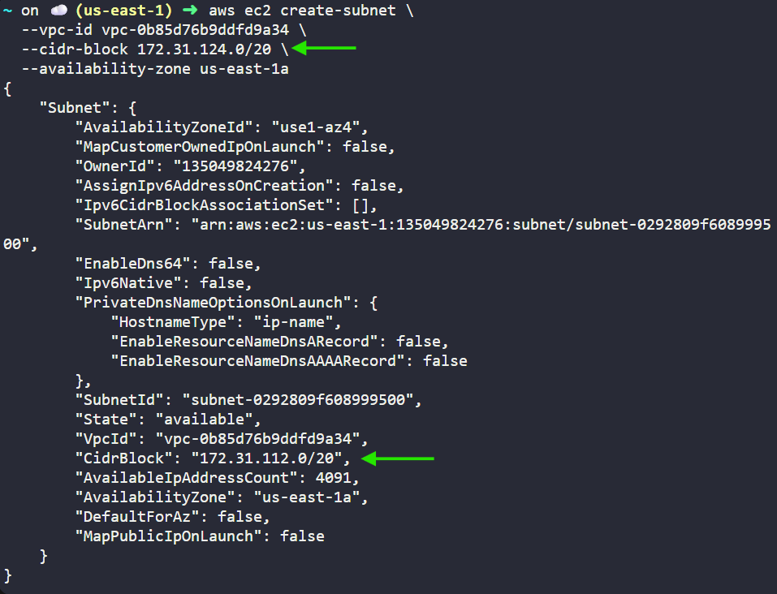
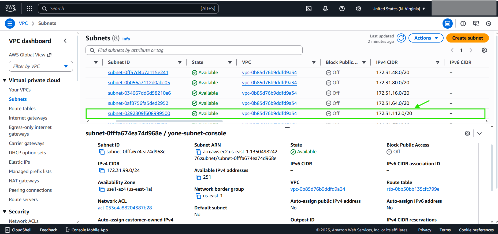

# FROM CONSOLE
***Selecting default VPC - Name -- Associated VPC's IPV4 CIDR Block && CIDR Block to allocate to the subnet ***
***If you are choosing the default VPC, AWS already created some subnets inside it, so beware from choosing a CIDR Block that overlaps with allocated one***

# DONE

# FROM CLI
***aws ec2 create-subnet \\***
  ***--vpc-id 'YOUR_VPC_ID' \\***
  ***--cidr-block 'YOUR_CIDR_BLOCK' \\***
  ***--availability-zone us-east-1a***

# DONE
